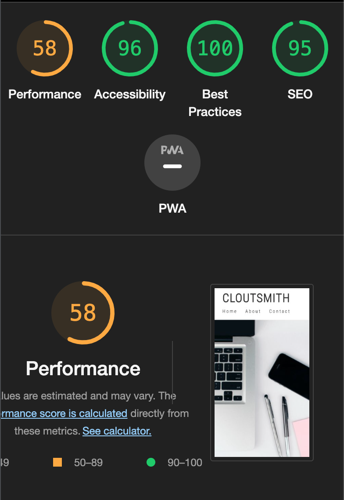
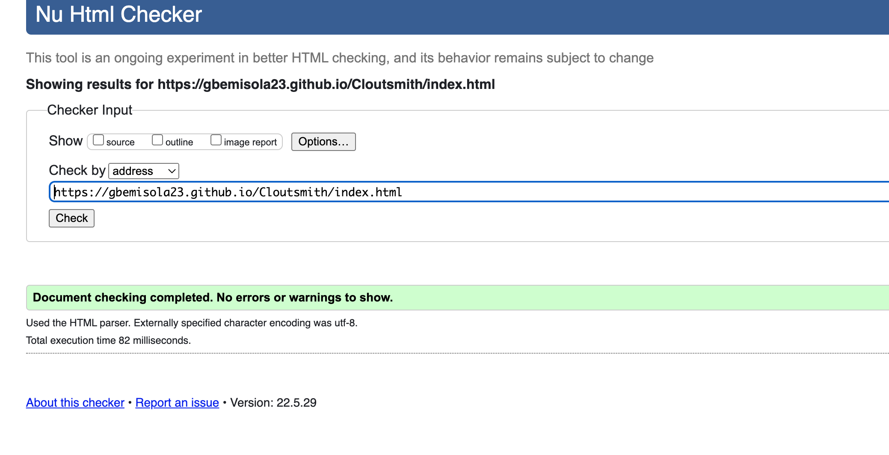
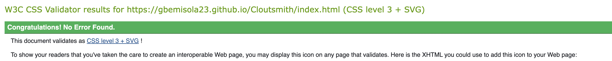

# Cloutsmith Portfolio

Cloutsmith Portfolio is a website created for those who are looking to hire a web and mobile software  developer for their business. Users of this site will be able to see various services rendered, know more about the company, contact Coutsmith.

The live website can be found here [Cloutsmith Portfolio](https://gbemisola23.github.io/Cloutsmith/index.html).

## Features

* **The Header**
  - The top left corner shows the name of the website 
  - The right hand corner shows the Home, About and Contact section. 
 

* **Our Services Section**
  - A brief description of the services the company renders.
  - The mid-page contains the background image.
  - The footer contains the company's contact detail and copyright.
  

* **About Section**
  - In this section, the user will know more about Cloutsmith.
  - The footer contains Cloutsmith's Contact details and copyright.

* **Contact Section**
  - A simple form that collects  Name, Email and Message for users that wants to get in touch with me.
  - The footer contains Cloutsmith's Contact details  and copyright.
    

* **The Footer**
  - The footer section includes Cloutsmith Contact info and copyright.

 

## Testing

* I've tested that this page works well in desktop verion.
* The iste doesn't work fully well in desktop version.
* I've confirmed that this project is not completely responsive on all screen sizes using dev tools.
* I confirmed by testing with users that the text of all sections is readable and easy to understand.

### Validator Testing

  * **HTML** 
    - No errors were found when passing through official W3C Validator.

  * **CSS**
    - No errors were returned when passing through the Jigsaw.
    
  

  * **Unfixed**    
    - No unfixed bugs.
 
     
## Deployment

The site was deployed to Github. The steps to deploy are as follows:
   - Credits
- In the GitHub repository, navigate to the Settings tab.
- Select 'Settings' from the navigation bar near the top of the page.
- Select 'Pages' from the sidebar on the left of the page.
- From the source section drop-down menu, select the Master Branch.
- Once selected, click the 'Save' button to the right of the dropdown menu.
- Deployment should be confirmed by a message on a green background - The message should have a green tick mark followed by "Your site is published at" followed by the web address.
- Confirm deployment by navigating to the displayed web address.

 The live website can be found here; [Cloutsmith Portfolio](https://gbemisola23.github.io/Cloutsmith/index.html).
  
 
## Credits

* Homepage banner from [https://www.pexels.com].
* About and contact banner from [www.freepik.com<]
* Icons from [Font Awesome](https://fontawesome.com/)
* Fonts from [https://fonts.google.com/]
* Some of the code for the Home and About were from the "Love Running" project.
* The code for the contact form were from True Coder on Youtube.
* Text gotten from Cloutsmith.com.
